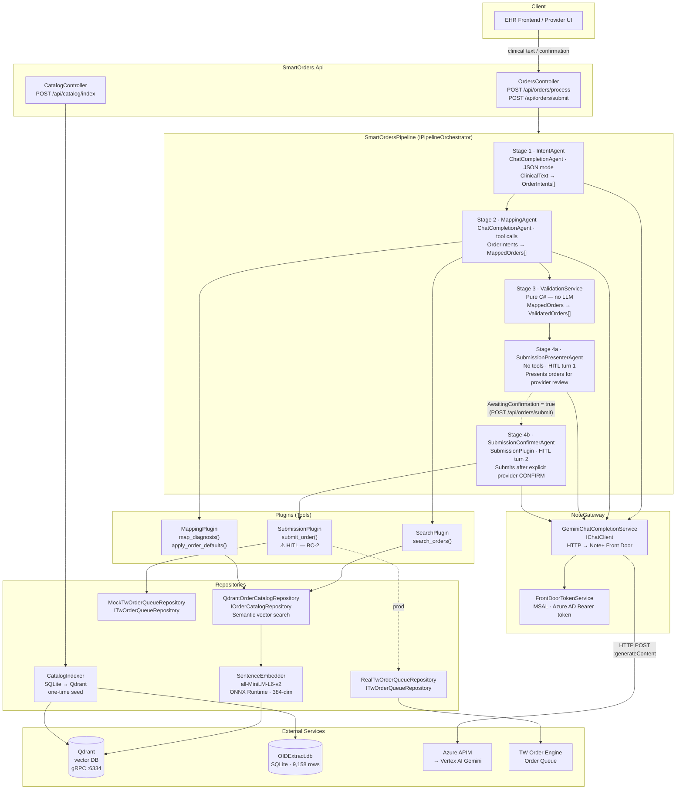
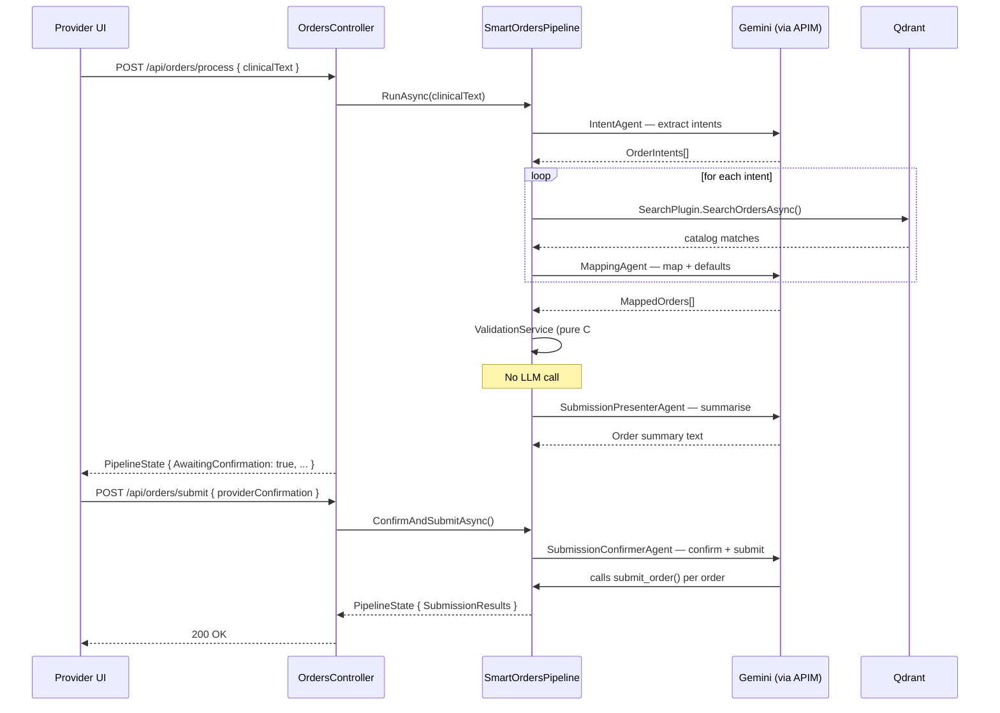

# Smart Orders — Pipeline Flow

## Pipeline Overview

---

## Layer Responsibilities

| Layer | Project | Responsibility |
|-------|---------|---------------|
| **API** | `SmartOrders.Api` | HTTP endpoints, DI root, `Program.cs`, static files |
| **Core** | `SmartOrders.Core` | Domain models (`OrderIntent`, `MappedOrder`, `ValidatedOrder`), interfaces — no framework deps |
| **Pipeline** | `SmartOrders.Infrastructure/Pipeline` | `SmartOrdersPipeline` — sequential orchestration of 4 stages |
| **Agents** | `SmartOrders.Infrastructure/Agents` | `AgentFactory` — creates all `AIAgent` instances |
| **Plugins** | `SmartOrders.Infrastructure/Plugins` | Tool implementations registered via `AIFunctionFactory` |
| **NoteGateway** | `SmartOrders.Infrastructure/NoteGateway` | `GeminiChatCompletionService` + `FrontDoorTokenService` |
| **Repositories** | `SmartOrders.Infrastructure/Repositories` | Qdrant, SQLite, TW Order Queue, ONNX embedder, catalog indexer |

---

## LLM Call Map

| Agent | Mode | Tools | Output |
|-------|------|-------|--------|
| `IntentAgent` | JSON mode (`responseMimeType`) | None | `OrderIntentsJson` |
| `MappingAgent` | Auto tool call | `SearchPlugin`, `MappingPlugin` | `MappedOrdersJson` |
| `SubmissionPresenterAgent` | Text | None | Order summary for provider |
| `SubmissionConfirmerAgent` | Auto tool call | `SubmissionPlugin` | `SubmissionResultsJson` |

---

## Data Flow

