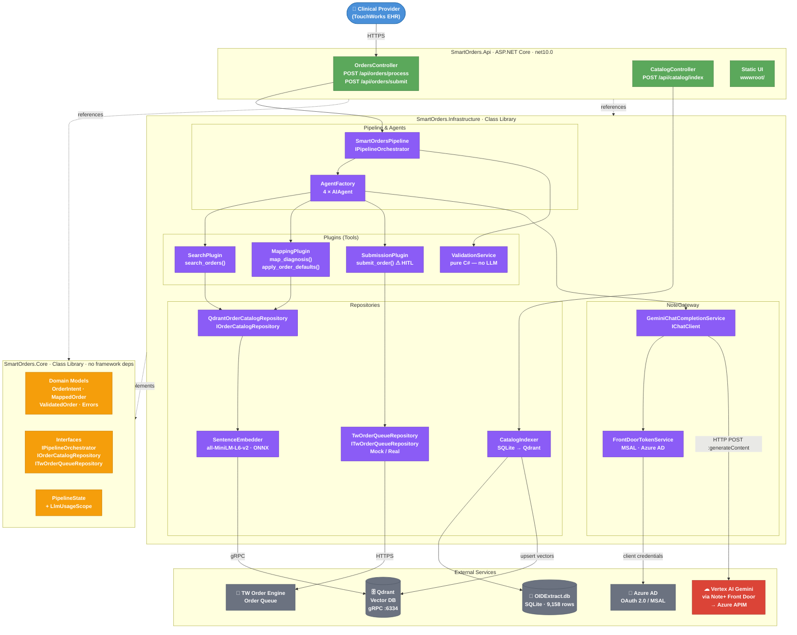
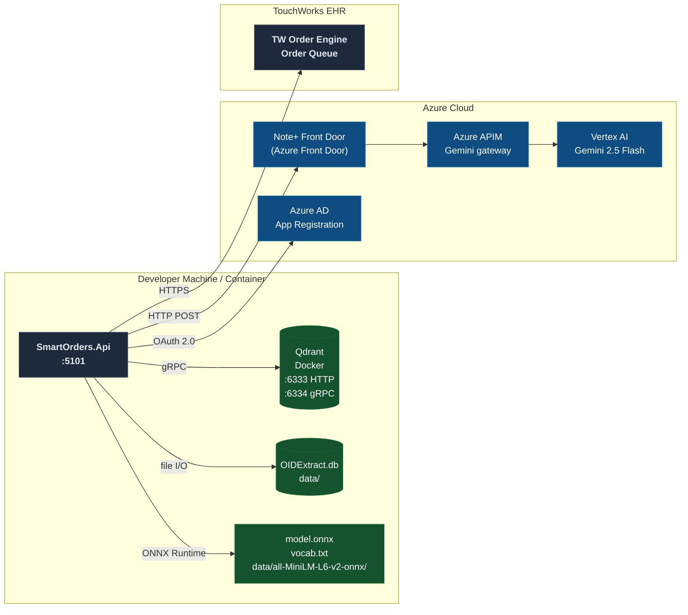

# Smart Orders — System Architecture

## Solution Layers

---

## Deployment View

---

## NuGet Dependencies

| Project | Key Packages |
|---------|-------------|
| `SmartOrders.Api` | `Microsoft.AspNetCore` · `Scalar.AspNetCore` |
| `SmartOrders.Infrastructure` | `Microsoft.Agents.AI 1.6.1` · `Qdrant.Client 1.13.0` · `Microsoft.ML.OnnxRuntime 1.21.0` · `Microsoft.ML.Tokenizers 2.0.0` · `Microsoft.Data.Sqlite 10.0.8` · `Microsoft.Identity.Client 4.84.1` |
| `SmartOrders.Core` | _(none — framework-free)_ |
